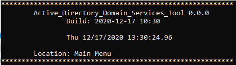
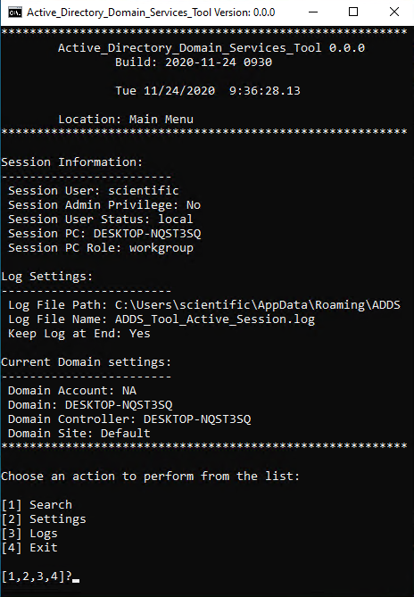

<h1 align="center"> Active Directory Domain Services Tool (ADDS_Tool) </h1>  

<h2 align="center"> :bangbang:  :construction:  :bangbang: UNDER DEVELOPMENT :bangbang:  :construction:  :bangbang: </h2>  

*Weekly build release*

## Table of Contents

- [Documents](#Documents)
- [Screenshots](#Screenshots)
- [Description](#Description)
- [Features](#features)
- [Dependencies](#Dependencies)
- [Changelog](#Changelog)
- [License](#License)

## Documents

 - [changelog.md](https://github.com/DavidGeeraerts/ADDS_Tool/blob/main/ChangeLog.md)

## Screenshots

## Description

Windows Command shell program that is a wrapper for ADDS toolset:
	- `DSQUERY`
	- `DSGET`
	- `DSADD`
	- `DSMOD`
	- `DSMOVE`
	
The advantage of using ADDS Tool over something like [Active Directory Explorer](https://docs.microsoft.com/en-us/sysinternals/downloads/adexplorer):
 - Command shell is faster.
 - Navigating shell menu is quicker.
 - Every search is saved to log file; text files are easy to extract information from, and stores a historical search record.
 - ADDS Tool allows setting parameters, most important is the `-limit` parameter, which by default is set to `-limit 0`, which is no limit.

*Why not PowerShell?*
I like the windows command shell. It does most of what's needed. When the shell is lacking, PowerShell can be leveraged, which the program does.

## Features

 What's Working

*Currently only searching is working.*

- [X] Main Menu
- [X] Settings Menu
- [X] Logs
- [X] Search Universal
- [X] Search User
- [X] Search Group
- [X] Search Computer
- [X] Search Server
- [X] Search OU

## Logs

Default for logging is pathed to: `%APPDATA%\ADDS`

`ADDS_Tool_Active_Session.log` --User session information

`ADDS_Tool_Session_Archive.log` --archive log for all sessions

`ADDS_Tool_Last_Search.log` --will contain last search results

`ADDS_Tool_Session_Search.log` --will contain all searches for the session

`ADDS_Tool_Search_Archive.log` --archive log for all searches

## Dependencies

ADDS_Tool requires (RSAT) [Remote Server Administrative Tools](https://docs.microsoft.com/en-us/troubleshoot/windows-server/system-management-components/remote-server-administration-tools). 
The program will ask to install if not detected, using [DISM](https://docs.microsoft.com/en-us/windows-hardware/manufacture/desktop/what-is-dism). 
Must be runnig with administartive privilege in order to install RSAT. 

[PowerShell](https://docs.microsoft.com/en-us/powershell/scripting/overview): Leveraged for some functions.

## Configuration

## License

[GPL](LICENSE)

:us: